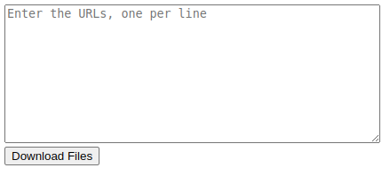

# adhoc_scripts
Scripts for adhoc changes. See below for details of each script

## make_SQL_statements.py
Script to generate the SQL query to update Moka.
This is normally performed by the [automated scripts](https://github.com/moka-guys/automate_demultiplex)
If the SQL query is not generated (e.g. when an error has occured), this script can be used to generate the query.

#### Required inputs:
- A text file with the samples list taken from the samplesheet
- For custom runs please provide: runtype, file, pipelineversion, runID. 
- For all ONC (inc TSO, SWIFT, Archer) runs please provide, runtype, file, pipelineversion, runID, NGSpanelID
pipelineversion and NGSpanelID can be found in the [automated scripts config file](https://github.com/moka-guys/automate_demultiplex/blob/master/automate_demultiplex_config.py)

#### make_SQL_statements.py --help:
'-r', '--runtype', help="Use: custompanels, ONC (includes ONC/Swift, ADX and TSO500), WES or SNP" <br>
'-f', '--file',  help="path to the txt file with samples in" <br>
'-p', '--pipelineversion', help="In number format e.g 4854" <br>
'-i', '--runid', help="e.g 220218_NB551068_0449_AHGML5AFX3 "       
'-n', '--ngspanelid', help="e.g 4396" 

## upload_runfolders.py
Script to generate commands to upload runfolders and samplesheets to DNA Nexus
This is normally performed by the [automated scripts](https://github.com/moka-guys/automate_demultiplex)
If errors with the automated scripts mean runfolders have not been uploaded to DNA Nexus, this script can be used to backup the runfolder. It uses the [backup_runfolder.py](https://github.com/moka-guys/workstation_housekeeping/blob/master/backup_runfolder.py) script.

#### Required inputs:
A text file (tab separated) with a list of runfolder names and DNA Nexus project names

#### Outputs:
- Text file with list of commands to run the backup_runfolder.py script 
- Text file with list of commands to run the DNA Nexus upload agent to upload the samplesheet to the workstation. Note: "/usr/local/src/mokaguys/.dnanexus_auth_token" will need to be replaced with the authentication token prior to running.

## manual_md5_checksum.py
Script to be run on the workstation to check the md5 check sum of three folders, across two copies of the same sequencing run 
This  is normally performed by the automated intergirty scripts on the sequencer (https://github.com/moka-guys/integrity_checking)
This adhoc script can be used if permissions errors on the sequencer mean python cannot be run and this cannot be resolved via the fix in KB article 'Failing Integrity checks on sequencers' (KB0010053)

To be run "python manual_md5_checksum.py -p /path/to/folder1/ -c /path/to/folder2/ > run_id_output.txt"

### Required inputs: 
- Full path to two folders 

### manual_md5_checksum.py --help:
'-p1', '--path1', help="Full path to runfolder 1" <br>
'-p2', '--path2',  help="Full path to runfolder 2" <br>                  

## bulk_url_downloader.html

This is a static webpage that can be used to automate the download of multiple URLs.  

- Save the HTML file locally and open it with the webrowser of your choice.
- Copy & paste the URLs into the text box pictured below and click 'Download Files'
- The files will be downloaded one by one.  If you are prompted for permission to download multiple files try adjusting the download delay in the HTML file which is currently set at 1 second.



### tso_upload_helper.sh

If run with the name of a TSO related project in DNA nexus as an argument, this script will partly populate the command required to upload the zip files to Qiagen:

```bash tso_upload.sh 002_240216_A01229_0290_AHNL5GDMXY_TSO24006```

The resulting command will be sent to std out with just the APP_ID and MOKAGUYS_AUTH_TOKEN needing to be added to each line, this can be done using find & replace.  IMPORTANT: HD200 and NTC samples (HD200 or 00000_00000 in sample name) should have their lines removed manually as these should not be uploaded.

## panelapp_gene_query.py

Generates a list of all signed-off gene/panel relations using the PanelApp API.

Confidence scores:

- Score 3 (lime green) - High level of evidence for this gene-disease association. Demonstrates confidence that this gene should be used for genome interpretation.
- Score 2 (amber) - Moderate evidence for this gene-disease association. This gene should not be used for genomic interpretation.
- Score 0 or 1 (red) - Not enough evidence for this gene-disease association. This gene should not be used for genomic interpretation.

### Usage:
```
python3 panelapp_gene_query.py
```

### Output:
CSV within the current working directory (```panelapp_gene_data.csv```). Data contains the following columns: gene_symbol, hgnc_id, panel_name, confidence_level and panel_id

### Testing:
Spotcheck of output CSV to ensure both:

- Results and confidence scores are reflected on the live PanelApp website
- All results pertain to signed-off panels

## okd_qc_commands.py

Automates the generation of DNAnexus MultiQC/FastQC commands for a given OncoDeep runfolder.
Must be ran on workstation where authkey file is present.
Requires use of Python 3.6+. Can use 'conda activate' where this isn't natively available.

### Usage:
```
python3 qcgen.py -p {dnanexus_project_id} -f {illumina_runfolder_name} -a {path/to/.authkey}
```
### Arguments:
-p, --project    The DNAnexus project ID for the run (i.e, project-XXXXXXXXXXX).
-f, --fastq_dir  The name of the run folder (i.e., 240521_A01229_0331_AHWGJGDRX3).
-a, --auth_token_file  The path to the file containing the DNAnexus authentication token.

### Output:
Shell script file within the current working directory named according to the run.

### Testing:
Concordance testing using diff commands performed against pre-existing manually generated multiqc_fastqc.sh scripts in the dx_run_commands directory.

Only deviation was in run 240507_A01229_0324_AH5CYWDRX5, where a manual entry mistake was identified.
